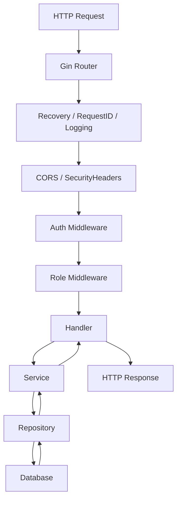
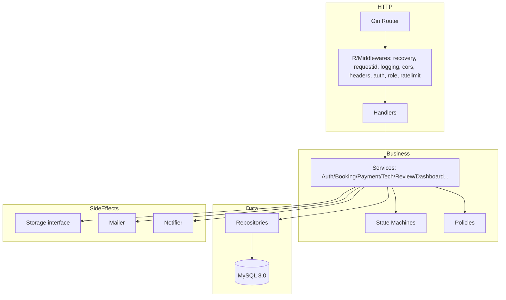
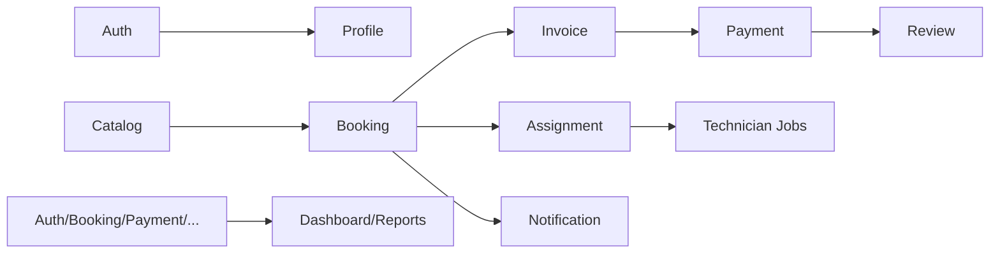

# Go Backend Architecture — golang-backend

Reference audits (source of truth):  
- `docs/laravel-audit.md`  
- `docs/api-inventory.md`  
- `docs/database-audit.md`  
- `docs/database-erd.md`

Laravel source: `C:\V1\api-dwidev`

---

## 1. Goals

The Go backend must:

- **Maintainable** — small packages, clear responsibilities, few concepts per file.
- **Testable** — business logic testable without HTTP/DB; repositories testable with a real DB; handlers testable with `httptest`.
- **Scalable** — stateless handlers, no shared mutable state; horizontal scaling requires nothing beyond a reverse proxy and a shared DB.
- **Secure** — replicate Laravel's OTP/token/role/ownership model; no SQL injection; no secrets in code.
- **Easy to understand** — no clever abstractions; names come from the Laravel domain (Booking, Payment, Technician).
- **Not overengineered** — only the layers that exist because the Laravel behavior demands them.
- **Behavioral parity** — every endpoint, validation rule, status code, state transition, and side effect matches the audited Laravel contract.
- **Fair benchmarking** — same DB, dataset, endpoint, payload, and workload as Laravel in every measurement.
- **REST API first** — match the existing Laravel route table exactly.

### What we are NOT doing

- No rewrite of the whole API in one phase.
- No new features, new fields, or new tables.
- No framework-specific lock-in in the business layer.

---

## 2. Technology Choices (Router)

### Comparison

| Criterion | net/http (stdlib) | Gin | Fiber |
|---|---|---|---|
| Performance | Good | Good | Very good (fasthttp) |
| Ecosystem | None needed | Large, mature | Growing |
| Middleware | Hand-rolled | Rich built-ins | Rich built-ins |
| Routing | Manual (Go 1.22+ supports patterns) | Param/method routing | fasthttp routing |
| Maintainability | High (few deps) | High | Medium |
| Learning curve | Steep (you build everything) | Shallow | Shallow |
| net/http compatibility | Native | Yes (http.Handler) | No (fasthttp) |
| Complexity | Minimal deps | Low | Low |

### Decision: **Gin**

Rationale:
1. **Already selected and present** in the existing minimal setup (`go.mod`: `gin-gonic/gin v1.12.0`). FASE 3 preserves the existing minimal setup.
2. **Behavioral parity is the project's top goal**, not raw speed. Gin is compatible with `net/http` (`http.Handler`), the entire stdlib toolchain (`httptest`, `pprof`) keeps working.
3. Rich binding + validation pipeline mirrors Laravel's FormRequest behavior closely.
4. Fiber's fasthttp is faster in microbenchmarks but breaks net/http compatibility (middleware, instrumentation, and standard tooling), which hurts our ability to benchmark fairly with standard tools.

Trade-offs accepted:
- Gin adds `gin.Context` in handlers; the **service layer must never import gin** (see §5). Gin is confined to a thin HTTP adapter layer.
- Performance differences vs stdlib are negligible for a DB-bound API (the bottleneck is MySQL, not routing).

---

## 3. Project Structure

```text
golang-backend/
├── cmd/
│   └── api/
│       └── main.go            # composition root: config → db → stores → services → handlers → router → server
│
├── internal/
│   ├── config/                # env loading + validation; plain structs; no secrets in code
│   ├── db/                    # connection pool, transaction manager, DBTX abstraction
│   ├── model/                 # pure domain models mapping 1:1 to Laravel tables
│   ├── repository/            # SQL access, one pkg per aggregate root (user, booking, ...)
│   ├── service/               # business logic, state machines, transactions (the heart)
│   ├── httphandler/           # gin handlers: parse → validate → call service → build response
│   ├── middleware/            # auth, role, request-id, security headers, cors, recovery, rate-limit
│   ├── auth/                  # token crypto + authenticator (Sanctum-equivalent)
│   ├── storage/               # private file storage abstraction (payment proofs)
│   ├── mailer/                # SMTP mailer + templating (OTP emails)
│   ├── notifier/              # database notification writer
│   ├── money/                 # int64 cent-based money type + JSON marshalling
│   └── httptypes/             # shared response/decorator types, error mapping
│
├── migrations/
│   └── ...                    # forward-only SQL schema (replicates Laravel final schema), applied manually
│
├── docs/                      # this and all prior audit documents
├── tests/
│   └── contract/              # Laravel ↔ Go contract fixtures + runner
│
├── .env.example
├── .gitignore
├── go.mod
├── go.sum
├── Dockerfile
└── compose.yaml
```

Folder responsibilities and prohibitions:

| Folder | Responsibilities | Must NOT contain |
|---|---|---|
| `cmd/api` | Wire everything; start server; graceful shutdown | Business logic; SQL; config values |
| `internal/config` | Read env→ struct; validate required vars | Secrets committed; business logic |
| `internal/db` | `database/sql` pool; `BeginTx`; `TxManager` | Route/HTTP code |
| `internal/model` | Pure structs + enums (no DB tags leaking into services) | DB drivers; handlers |
| `internal/repository` | Only SQL + struct scan; no HTTP, no validation | Business rules; gin |
| `internal/service` | Orchestrate repos, enforce rules, state machines, transactions | `net/http`, gin, SQL |
| `internal/httphandler` | Translate HTTP → service calls → response JSON | SQL; business rules |
| `internal/middleware` | Cross-cutting HTTP concerns | Business rules |
| `internal/auth` | Token create/lookup/validate | HTTP wiring |
| `internal/storage` | File upload/download/delete behind an interface | HTTP handlers |
| `internal/mailer`, `internal/notifier` | Outbound side effects | HTTP |
| `internal/money` | Money math/formatting | DB |

Layers not created on purpose (YAGNI): no `pkg/` (nothing is meant for external import yet), no `internal/event` or message bus, no `internal/cache` (Laravel cache store is only used for framework internals, not domain logic), no service for every domain (thin CRUD uses repositories + handlers directly).

---

## 4. Request Flow



Layer responsibilities:

| Layer | Responsibility |
|---|---|
| Router | Match `method`+`path` to a handler; apply middleware groups (mirrors Laravel route groups) |
| Middleware | Cross-cutting: auth, role, request-id, security headers, CORS, recovery, logging, rate limit |
| Handler | Parse body, bind params, decode multipart; call service; map domain error → HTTP status/JSON. **No SQL, no business rules.** |
| Service | Orchestrate repositories; validate business rules; run transactions; apply state machines; dispatch notifications/emails. **No HTTP**, **no SQL**. |
| Repository | SQL statements, row locking order, scan to models. No business rules. |
| Database | MySQL 8.0, same schema as Laravel |

Ownership:

| Concern | Owner |
|---|---|
| Request parsing & format validation | Handler (with shared validation helpers) |
| Business validation | Service |
| Authorization (role) | Role middleware |
| Authorization (resource ownership) | Service (invoking policy functions) |
| Transactions | Service (via `TxManager`) |
| Response shaping | Handler |
| Error mapping | Centralized `httperr` map used by handler |
| DB access | Repository only |

---

## 5. Dependency Rule

```text
cmd/api
   ↓
router / middleware / handler
   ↓
service
   ↓
repository
   ↓
database

storage / mailer / notifier / auth  ← injected into service (interfaces)
```

Rules:
- **Repository never imports handler/middleware/gin.**
- **Service never imports `net/http` or gin.** Business logic speaks in domain errors.
- **Model never imports a web framework.**
- **Handler imports service via small interfaces** (not the concrete service struct) — this is the minimal dependency inversion: handlers depend on what the service *does*, services can be faked in handler tests.
- **Service depends on repository *interfaces*** so service tests can use a fake repository; production wires real repositories.

> Interface explanation (Go learning note): an interface is a contract of methods, not a class hierarchy. `BookingReader interface { FindByID(ctx, id) (*model.Booking, error) }` lets the service call a method without caring whether the implementation is MySQL, SQLite, or a test stub. Consequence: you pay with a bit of indirection; you gain the ability to test business logic without a database and to swap implementations (e.g., MySQL ↔ SQLite for tests). The cost only makes sense on the *boundaries* the project actually needs — service↔repository and service↔storage — not everywhere.

---

## 6. Domain Architecture

Mapping from FASE 1, with whether each domain needs the full vertical slice:

| Domain | Model | Repository | Service | Handler | Validation | Authz | Transaction boundary |
|---|---|---|---|---|---|---|---|
| Auth (register/login/logout) | User, Otp | User, Otp | AuthService | + | + | none | Otp verify/reset |
| User/Profile | User | User | ProfileService | + | + | — | none |
| Customer Profile | CustomerProfile | User | (thin → direct) | + | + | role | none |
| Catalog (public) | Category/Service/Package | Catalog | (thin → direct) | + | partial | none | none |
| Catalog (admin CRUD) | same | Catalog | PackageService (items tx) | + | + | role | package store/update |
| Booking + Invoice | Booking/Item/Invoice | Booking | BookingService | + | + | role+policy | create/cancel |
| Payment | Payment | Booking/Invoice | PaymentService | + | + | role+policy | proof/verify/reject |
| Technician | User/TechnicianProfile | Technician | TechnicianService (tx for create/toggle) | + | + | role | store/update |
| Assignment | BookingAssignment | Booking | AssignmentService | + | + | role+policy | assign |
| Notification | (DB row) | Notification | NotificationService | + | — | role+ownership | none (writes inside other txs) |
| Review | Review | Booking/Review | ReviewService | + | + | role+policy | store |
| Dashboard/Reports | — | Dashboard | DashboardService (aggregates) | + | — | role | none |

Thin CRUD (customer profile, public catalog) reuses handler→repository directly; **no service layer for pure read-only aggregation-free queries**. This keeps the codebase small while reserving the vertical slice where behavior demands it.

---

## 7. Model / DTO Strategy

Four distinct types, never reused blindly:

| Type | Purpose | Fields | Example |
|---|---|---|---|
| **Database model** (`internal/model`) | 1:1 with tables; persistence shape | All columns, SQL/scan friendly | `User` with all columns |
| **Request DTO** (`internal/httphandler/*dto.go`) | Incoming HTTP body | Only client-supplied fields | `RegisterRequest{Name,Email,Password,PasswordConfirmation}` |
| **Response DTO** | Outgoing JSON; must match Laravel Resource shape exactly | Only what Laravel exposes (ref. api-inventory) | `UserResponse{ID,Name,Email,Role,...}` |
| **Domain model** (reuse DB model) | Used by services for rules + transitions | Same as DB model initially | `Booking` carries `Status` + methods |

Guidance:
- One struct for DB+domain initially (upgrade to separate domain struct only when a rule requires computation that does not belong in persistence).
- Never expose DB model directly to HTTP; always a Response DTO, because Laravel's `API Resource` classes hide fields (e.g., password) and rename keys. Parity is at the DTO boundary.
- Request DTOs carry struct tags only for JSON decode (and validator tags); they are not stored anywhere.

---

## 8. Money / Decimal

FASE 6: 11 monetary columns, all `DECIMAL(12,2)`.

### Options compared

| Approach | Precision | Ease | DB round-trip | Risk |
|---|---|---|---|---|
| `int64` smallest unit (sen) | Exact | Medium | Needs *100 /100 | Integer overflow only at extreme values (12,2 → max ~109.9 billion, fits int64) |
| Decimal library (`shopspring/decimal`) | Exact | Medium high | Good | Extra dep; heftier |
| `string` | Exact | Low | None (native) | Arithmetic/clamp are painful; slower |
| `float64` | Lossy | High | Rounding drift | **Unacceptable for money/benchmarks** |

### Decision: `int64` in cents (smallest unit)

- Canonical in-memory representation: `internal/money.Money` = `int64` cents with JSON that marshals as `"12345.67"` (string, matching Laravel `decimal:2` cast output) and helper `Mul(int)` implementing the same integer arithmetic Laravel's `BookingPricingService` uses.
- DB read/write: `DECIMAL(12,2)` ↔ cents conversion at repository boundary (one helper). MySQL returns `[]byte` for DECIMAL; parse with `big.Rat` or `strconv` on the two-digit string — never float.
- Why not the decimal library: integer cents is dependency-free, exact, and plenty for rupiah-scale Domain. If multi-currency/rounding policies grow, `shopspring/decimal` is the upgrade path (documented `ponytail:`).

---

## 9. Transaction Strategy

**Polar: service-owned transaction (Unit of Work).** Handlers never open transactions; repositories never auto-commit multi-statement operations.

```text
Service:
  tx, err := txManager.Begin(ctx)          // BEGIN
  defer tx.Rollback() (unless committed)
  repo := dbfactory.WithTx(tx)              // repos now use tx's Execer/Queryer
  ... business steps ...
  tx.Commit()                               // COMMIT
```

- `TxManager` exposes `Begin(ctx) (Tx, error)`; `Tx` provides `Execer/Queryer` and `Commit/Rollback`.
- All **17 Laravel transactions** map 1:1 to service methods:
  - register/verify/reset (OTP + token)
  - booking create (+ item + invoice, with `FOR UPDATE` on catalog rows)
  - booking cancel (+ invoice `cancelled`)
  - payment proof (file + payment + invoice + booking transition)
  - admin verify / reject payments
  - assign (reject old + create new + booking transition)
  - admin booking verify/reject completion
  - package store/update (items cascade)
  - technician store
  - assignment accept/reject/start/complete
- **Rollback behavior**: return `error` from any step → `Rollback()`; for the payment-proof endpoint, the file write must *also* be cleaned up (see §17) because Laravel deletes the file on exception.
- No automatic retry inside the service; a single retry-on-`Deadlock` wrapper is acceptable at the TxManager level, but the default is fail-fast.

---

## 10. Concurrency / Row Locking

Laravel uses `lockForUpdate()` (`SELECT ... FOR UPDATE`). We preserve it.

| Domain | Locked rows | Parallel-safety reason |
|---|---|---|
| Booking create | `services`/`packages` rows | Prevent over-scaling a price snapshot against concurrent admin edits |
| Payment proof | `invoices` + `bookings` | Prevent duplicate/race duplicate proof; state transitions must be atomic |
| Admin payment verify/reject | `payments` + `invoice` + `booking` | Prevent double-verify; revenue count consistency |
| Assign technician | `bookings` + old `assignments` | One active assignment at a time |
| Technician job actions | `booking_assignments` + `booking` | Status transition ordering |
| Admin completion verify | `bookings` + `assignments` | Approve/reject must not race with technician actions |

Implementation notes:
- Repositories support `*Lock` variants, e.g. `FindByIDLocked(ctx, tx, id)` emitting `SELECT ... FOR UPDATE`.
- Transactions must always lock in a **fixed order** (child before parent, consistent across code paths) to avoid deadlock patterns; documented per domain.
- MySQL default isolation REPEATABLE READ is acceptable for these short transactions; we do not change isolation unless benchmarking shows a need.
- All state-transition endpoints therefore acquire `FOR UPDATE` inside the service-owned tx.

---

## 11. State Machine Strategy

Modeled directly on Laravel `Booking::transitions()` + `transitionTo()`.

- Each stateful model exposes a **transition table** (map from → allowed set) in its own package: `booking.Transitions`, `payment.Transitions`, `invoice.Transitions`, `assignment.Transitions`, `review.Transitions`.
- A small helper `TryTransition(model) error`:
  - checks `from` state is in the map,
  - checks the target is allowed,
  - (optionally) an actor check callback for guarded transitions,
  - on failure returns a typed **conflict/unprocessable error** matching Laravel's 409 (booking transition) / 422 behavior.
- All state writes go through the state machine result (`Next`), never set directly from handlers.
- Terminal states (completed/cancelled/succeeded/rejected...) reject any further transition.

```text
Booking transitions (from FASE 2):
pending_payment → waiting_verification, cancelled
waiting_verification → paid, pending_payment, cancelled
paid → confirmed, cancelled
confirmed → technician_assigned, cancelled
technician_assigned → in_progress, confirmed
in_progress → awaiting_verification
awaiting_verification → completed, in_progress
completed / cancelled → (terminal)
```

Who may transition:

| Transition | Actor |
|---|---|
| pending_payment → waiting_verification | Customer (payment proof) |
| waiting_verification → paid, pending_payment | Admin (verify/reject) |
| confirmed → technician_assigned | Admin (assign) |
| pending → accepted/rejected | Technician |
| accepted → in_progress | Technician (start) |
| in_progress → awaiting_verification | Technician (complete) |
| awaiting_verification → completed | Admin (approve completion) |
| awaiting_verification → in_progress | Admin (reject completion) |
| any (non-terminal) → cancelled | Customer (cancel, gated by policy) |

---

## 12. Authentication

Laravel Sanctum = opaque bearer token stored in `personal_access_tokens` (SHA-256 hash, plaintext prefix). Equivalent in Go:

- **Token generation (register/login/verify)**: random 40-char base64url token → store `SHA256(token)` **and** keep the plaintext prefix (first 7 chars) for indexed `like` lookup (Sanctum semantics), plus `expires_at` (default 7 days per `SANCTUM_TOKEN_EXPIRATION`).
- **Token validation (middleware)**: read `Authorization: Bearer` → SHA256 lookup → check `expires_at` → load user → attach to context.
- **Logout**: delete the row (revoke current token).
- **Password/e-mail-address change**: delete all tokens for the user (parity: Laravel does this).
- **Verification**: un-verified login returns 403 (parity).

### Authentication vs Authorization

- **Authentication** = "who is this?" — the Auth middleware only resolves the token to a User.
- **Authorization** = "may this user do X?" — split into:
  - **Role authorization** (middleware, matches `role:customer`/`technician`/`admin,super_admin`),
  - **Resource authorization** (policy functions, see §13).

---

## 13. Authorization

Two complementary mechanisms, mirroring Laravel's `RoleMiddleware` + Policies.

### Role (middleware)
`RequireRole(roles ...string)` reads the authenticated user's `Role`; mismatch → 403 `{message:"Forbidden."}`.

### Resource (policy functions)
Implemented as methods on services or standalone `policy` helpers taking `(ctx, user, resource)`:

| Policy | Rule (from FASE 1) |
|---|---|
| `Booking.View/Cancel` | `user.id == booking.customer_id` |
| `Invoice.View` | owner of the underlying booking |
| `Payment.View` | admin/super_admin OR owning customer |
| `Payment.Verify` | admin/super_admin |
| `Assignment.View/Act` | technician owns the assignment |
| `Review.Create` | customer + owns booking + booking completed + has technician + no existing review |
| `Review.View` | customer (booking owner) or technician |
| `Review.Moderate` | admin/super_admin |

Policies are invoked inside services (after auth/role), before any write, and within transactions where locking already occurred.

---

## 14. Validation

Three distinct layers (never mixed):

```text
1. HTTP decode errors        → 400-ish malformed JSON/payload (Handler)
2. Structural validation     → 422 ValidationFailed, shape exactly like Laravel
                                 { "message": "The given data was invalid.", "errors": { field: [msgs] } }
3. Business validation       → 409 Conflict / 422 Unprocessable (Service, domain errors)
```

- **Structural**: go-playground/validator with struct tags on Request DTOs, replicating the 28 FormRequest rule sets (email, min, required_if:item_type, in:[...], exists → translated to "exists" by an explicit DB check in service, digits:6, etc.). Error strings follow Laravel's Indonesian message style where the contract exposes them.
- **Business**: service-side checks (complete profile before booking, active catalog, single pending payment, duplicate review, OTP expiry/attempts, amount matches invoice) throwing typed domain errors.

---

## 15. Error Architecture

Centralized mapping in `internal/httperr`:

| Domain error | HTTP status | Response JSON |
|---|---|---|
| `ValidationFailed(errors map[string][]string)` | 422 | `{"message":"The given data was invalid.","errors":{...}}` |
| `Unauthenticated` | 401 | `{"message":"Unauthenticated."}` |
| `Forbidden` | 403 | `{"message":"Forbidden."}` |
| `NotFound` | 404 | `{"message":"Resource not found."}` |
| `Conflict` | 409 | domain message |
| `TooManyRequests` | 429 | `{"message":"Too many requests. Please try again later."}` |
| `Unprocessable` | 422 | domain message |
| `BadRequest` | 400 | domain message |
| `Internal` | 500 | `{"message":"Server error."}` + server-side structured log (request id, route, exception type) |

Rules:
- Database driver errors are **never** returned to the client verbatim; mapped to `Internal` and logged.
- All API error responses are JSON even on 4xx/5xx (matches `bootstrap/app.php`).

---

## 16. Middleware

| Middleware | Mirrors | Notes |
|---|---|---|
| Recovery | — | gin.Recovery equivalent, maps panics → 500 JSON |
| RequestID | `RequestIdMiddleware` | accept/propagate `X-Request-ID`, echo in response + logs |
| SecurityHeaders | `SecurityHeadersMiddleware` | `X-Content-Type-Options`, `X-Frame-Options`, `Referrer-Policy`, `Permissions-Policy`; HSTS when `SECURITY_HSTS` and HTTPS |
| CORS | `CorsAllowlistMiddleware` | allowed-origins from config; strip headers for disallowed origins |
| Logging | — | structured request log (method, path, status, latency, request id) |
| RateLimit | `ThrottleRequests:*` | the 8 Laravel limiters (auth-login 10/m, register 5/m, otp-verify 10/m, otp-resend 3/10m, password-reset 5/10m, booking-create 10/m, payment-upload 5/10m); in-memory token bucket first, Redis upgrade documented |
| Auth | `auth:sanctum` | see §12 |
| Role | `role:*` | see §13 |

Order on protected handlers: `recovery → requestid → logging → cors → securityheaders → auth → role → handler`.

---

## 17. File Storage

Interface-driven (parity with Laravel `payment_proofs` private disk):

```go
type Storage interface {
    Upload(ctx context.Context, key string, r io.Reader) error
    Download(ctx context.Context, key string) (io.ReadCloser, error)
    Delete(ctx context.Context, key string) error
    Exists(ctx context.Context, key string) (bool, error)
}
```

- Only impl in this phase: `LocalStorage` rooted at configured private directory (default `storage/app/private/payment-proofs`).
- Business rule: proof upload stores file then DB in the same transaction; on DB failure Go deletes the just-written file (matching Laravel's cleanup-to-avoid-orphans).
- Future: S3-compatible impl behind the same interface (no call-site changes).

---

## 18. Async / Queue

Audit: queue usage is OTP emails (`PasswordResetOtpMail`), plus DB `notifications` rows.

- **DB notifications** (`notifications` table) are written synchronously inside the same transaction as the domain change (SystemNotification in Laravel is `database`-only and dispatched within the request). Go writes the notification rows in the same `Tx`.
- **OTP emails**: Laravel queues them (database queue). Go: an **in-process worker** with a small channel (bounded) + `net/smtp` mailer; retry (tries=3) and a `failed` log path. This keeps behavior parity (email is sent asynchronously) without adding Redis/Kafka infrastructure.
- Explicitly **no** Redis/RabbitMQ/Kafka this phase — no requirement for them; add only if benchmarking/ops shows the in-process worker is the bottleneck.
- `jobs`/`job_batches`/`failed_jobs` tables are Laravel-internal; replicated schema is optional (`migrations/` Git will not attempt to run Laravel jobs).

---

## 19. Observability

- **Logging**: `slog` (stdlib) JSON handler; interface `internal/logger.Logger` so business logic doesn't import a concrete logger. Fields: request_id, method, path, status, latency_ms, user_id where available, error class.
- **Request ID**: generated or propagated via middleware; correlated in all log lines; returned in `X-Request-ID`.
- **Metrics**: optional histogram of latency/status per route; not wired this phase (avoid over-engineering); the `/api/health` endpoint is tested and monitored.
- Error logging mirrors Laravel: never log authorization headers, passwords, OTPs, full payment-proof paths.

---

## 20. Testing Architecture

| Level | Target | Isolation |
|---|---|---|
| Unit | Service logic, state machines, money math | Fake repository / fake storage interface |
| Repository | SQL scan, row locking | Real test DB (MySQL container) with migrations applied |
| Handler/API | HTTP method/status/body, authz, validation | Real services + fake repos OR full stack against test DB via `httptest` |
| Integration | API → service → repository → DB | Full app binary against a disposable MySQL schema |
| Contract | Go vs Laravel parity | Recorded fixtures captured from Laravel in FASE 11 |

- `go test ./...` is the single gate.
- `tests/` holds fixtures; `contract/` holds the parity runner.
- Fake types are generated only where they pay for themselves (booking service, storage, mailer); no blanket mocking framework — `go.uber.org/mock` only if a mock count justifies it, else hand-written stubs.

---

## 21. Benchmark Methodology

Design only (no claims this phase). Later FASE 12–14 will execute.

- **Controlled variables**: same machine, same MySQL, same dataset (seeded identically from `DevE2eSeeder`), same endpoint set, same payloads, same concurrency profile.
- **Workload**: user-selected (initial suggestion 100 concurrent / N requests at `/api/categories` (read) and `/api/bookings` (write) — finalized after FASE 12 baseline).
- **Tool**: a single load generator used for both stacks (e.g., `hey`/`k6`) to avoid tool skew.
- **Metrics**: P50/P95/P99 latency, requests/sec, error rate, CPU%, memory (peak).
- **Process**: record Laravel baseline → record Go → identical command/params → compute deltas with the agreed formula. No cherry-picking; any difference in environment invalidates the comparison and is documented.

---

## 22. Security Architecture (prioritized checklist)

| Priority | Control | Action |
|---|---|---|
| Critical | Password hashing | bcrypt cost 12 (matches Laravel `BCRYPT_ROUNDS`); never log |
| Critical | OTP | 6-digit, bcrypt hash stored, single-use (`used_at`), expiry, attempt cap (5) |
| Critical | Token security | 40-char random, only SHA-256 stored, 7-day expiry, revoke on logout/password-change |
| Critical | SQL injection | Only parameterized queries (prepared statements) |
| High | Input validation | 3-layer validation; size limits on body; strict multipart for proofs |
| High | Private file access | Proof served only via authenticated endpoints with policy checks |
| High | Error exposure | Never return stack/driver errors (`Server error.`) |
| High | Secrets | `.env` git-ignored; config from env only; example file has no values |
| High | CORS | Allowlist exactly like Laravel; no wildcard |
| Medium | Rate limiting | 8 limiters, in-memory now |
| Medium | Security headers | Middleware (reflects Laravel) |
| Medium | Request size | cap on JSON body + proof file max 2048KB/mime allowlist |
| Medium | Trusted proxy | `X-Forwarded-For` only from trusted proxies (env-configurable) |
| Low | Audit logging | request id + route + user id; no sensitive values |

---

## 23. Dependency Selection

| Dependency | Purpose | Why | Alternative | Trade-off |
|---|---|---|---|---|
| `github.com/gin-gonic/gin` | HTTP router/binding | Mature, net/http-compatible, mirrors Route+FormRequest | stdlib (more code), Fiber (fasthttp lock-in) | Slight routing overhead; introduces gin.Context (contained to handlers) |
| `github.com/go-playground/validator/v10` | Structural validation | Mirrors 28 FormRequest rules ergonomically | Hand-written checks | Tag reflection; array/object rules need custom funcs |
| `github.com/go-sql-driver/mysql` | MySQL driver | Required by `database/sql` | `pgx` (wrong dialect) | Standard |
| `golang.org/x/crypto` | bcrypt | Password + OTP hashes | `crypto/bcrypt` in stdlib? (not available; x/crypto is canonical) | Vendored crypto |
| `github.com/google/uuid` | notification UUID PK | UUID column exists | stdlib `crypto/rand` (more code) | Vendored dep |
| `log/slog` (stdlib) | Logging | JSON structured logs | zerolog/zap (heavier) | Fewer features |
| `net/smtp` (stdlib) | OTP email transport | SMTP only | `gomail` wrapper | Low-level |
| `net/http/httptest` (stdlib) | API tests | Native | testify/httptest | — |
| `github.com/stretchr/testify` (dev) | Test asserts | Readable failure messages | plain stdlib t | Extra dev dep |

Explicitly **not** added this phase: Redis client (threshold-based), message broker, OpenTelemetry, GORM/sqlc (`database/sql` chosen: exact control of `FOR UPDATE` and mapping, zero ORM magic — see FASE 6 for the comparison), decimal library (money = cents).

---

## 24. Final Architecture Diagram



Domain-level dependencies:



---

## 25. Migration Strategy (from Go's perspective)

- Deploy **incrementally per domain** (FASE 7 order from api-inventory: Auth → Profile → Catalog → Booking+Invoice → Payment → Technician+Assignment → Notification → Review → Dashboard).
- Each domain ships: model + repository + service + handler + validation + tests.
- Schema: single forward-only SQL under `migrations/` replicating the audited final schema (idempotent `CREATE TABLE`, matching MySQL 8.0). Applied manually/tooled per environment; **no destructive operations**.
- Laravel keeps running unchanged as the parity baseline until the Go contract tests pass for every migrated endpoint.
- Cutover is per-domain: route traffic to Go for a domain only after its contract + integration tests are green.

---

## Validation Against FASE 0–2

- Endpoint/count/method/role inventory carried over verbatim from `api-inventory.md` (63 endpoints).
- Schema fields/constraints/FKs from `database-audit.md` (23 tables, 19 FKs, 12 unique, decimals 12,2).
- State machines transcribed from `Booking::transitions()` and controller logic (FASE 2).
- 17 service transactions map the audited Laravel transaction set.
- Storage, policy, OTP, and rate-limit behavior cited from FASE 1/2 source inspection.
- No endpoint, status code, field, or rule was invented in this blueprint; every design element references its Laravel origin.

### Migration Risks Carried Forward

| Risk | Severity | Mitigation in this design |
|---|---|---|
| Money precision | HIGH | Money type = int64 cents + string JSON |
| Row locking parity | HIGH | Repository `FOR UPDATE` variants; fixed lock order |
| State machine parity | HIGH | Service-coupled transition tables |
| Transaction behavior | HIGH | Service-owned TxManager, defer Rollback |
| OTP/token crypto parity | MEDIUM | bcrypt + SHA-256 token +
| File-in-transaction | MEDIUM | Storage cleanup on rollback |
| Unique code generation | MEDIUM | Retry on unique-violation with bounded attempts |
| Isolation differences (SQLite vs MySQL) | LOW | Repository tests target MySQL container, same as prod engine |